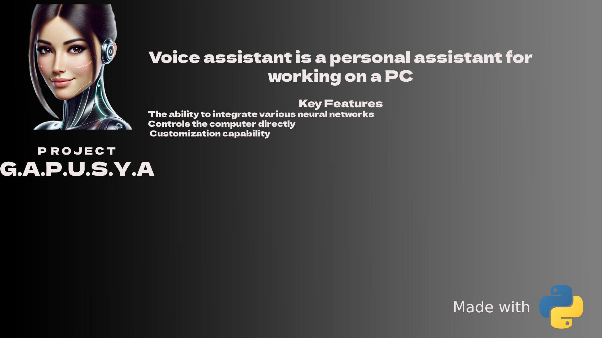
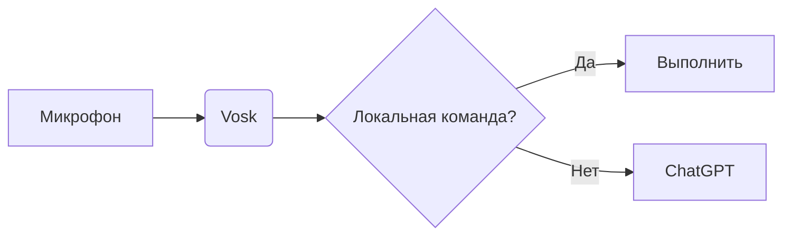

# 🚀 Астра: Оффлайн-голосовой ассистент на Python


**Астра** — это голосовой ассистент с локальным распознаванием речи (Vosk) и синтезом (pyttsx3). Он умеет управлять системой, искать информацию в интернете, играть музыку/фильмы и даже общаться через ChatGPT!  

> 🔥 **Ключевые преимущества**:  
> - 90% функций работают оффлайн  
> - Полная конфиденциальность (данные не уходят в облако)  
> - Гибкая система команд
> - Интеллектуальные ответы через локальные LLM-модели, управляемые через LLM Studio  
## 📌 Оглавление  
- [Возможности](#возможности)  
- [Требования](#требования)
- [Структура проекта](#структура-проекта) 
- [Архитектура системы](#архитектура-системы)  
- [Технологии](#Технологии)
- [Настройка ИИ-ответов](#настройка-ии-ответов)  
- [Дорожная карта](#дорожная-карта)  
- [Установка](#установка)      


##  Возможности
- **Голосовое управление**: Просто скажите "Астра" и команду.  
- **Системные команды**:  
  - 🖥️ Выключение/перезагрузка ПК
  - ⏰ Узнать время и дату  
  - 🗑️ Очистка корзины  
  - ⌨️ Горячие клавиши
  - 📋 Ввод текста голосом 
- **Мультимедиа**:  
  - 🎵 Воспроизведение музыки (через Hitmotop)  
  - 🎥 Просмотр фильмов (через Kinopoisk)  
- **Интернет**:  
  - 🌤️ Погода (через wttr.in) [~~OpenWeather~~] *(в настоящее время не используется)*  
  - 🔍 Поиск в Яндекс  
   - 💬 Общение через **LLM Studio** с локальными моделями  
    - Настроенный `system_prompt` для кратких и дружелюбных ответов  
    - Если запрос требует точных данных (курс валют, новости), предложи поиск в интернете
    - Не поддерживает вредоносные, опасные или неэтичные запросы
## Требования    
- Windows 10/11
- Python 3.8+  
- Микрофон  
- Интернет
- Google Chrome

## Структура проекта
```text
Voice_Assistant/
│
├── assistant_core.py             # Основной модуль ассистента
├── main.py                       # Точка входа программы
├── commands.json                 # Конфигурация команд ассистента
├── settings.json                 # Настройки устройства
├── speech_module.py              # Распознавание речи
├── tts_module.py                 # Синтез речи
├── sound_module.py               # Воспроизведение звуков
├── system_control.py             # Управление системой (выключение, горячие клавиши)
├── interface.py                  # GUI ассистента
├── chat_gpt.py                   # Локальная интеграция ChatGPT
│
├── network/                      # Сетевая логика
│   ├── __init__.py               # Инициализация пакета
│   ├── network.py                # Основные сетевые операции
│   ├── music_service.py          # Воспроизведение музыки
│   └── film_service.py           # Воспроизведение фильмов
│
├── sounds/                       # Аудиофайлы для ассистента
│   ├── start.mp3
│   └── shutdown.mp3
├── main_applications/            # Ярлыки программ
│   ├── Google Chrome.lnk
│   ├── Telegram.lnk
│   └── WhatsApp.lnk
│
└── img/                          # Изображения и иконки для проекта (баннер, иконки и др.)
│
├── logs/                         # Логи работы ассистента
│   └── assistant.log
├── requirements.txt              # Зависимости проекта
```
## Архитектура системы

## Дорожная карта
### 🖱️ Управление мышью
- [ ] Скроллинг страниц вверх/вниз

### 💻 Управление Windows
- [x] Выключение ПК
- [x] Перезагрузка ПК
- [x] Спящий режим
- [x] Очистка корзины
- [ ] Создание папок/документов
- [ ] Управление громкостью (повышение/уменьшение/выключение)
- [ ] Создание скриншотов

### 📝 Работа с текстом
- [x] Печать текста голосом
- [ ] Копирование/вставка текста
- [ ] Эмуляция нажатия пробела
- [ ] Смена языка ввода
- [ ] Отправка сообщений
- [ ] Удаление выделенного текста

### 🌐 Интернет-функции
- [x] Чтение новостей
- [x] Ozon
- [x] Wildberries

### ▶️ Онлайн-медиа
- [ ] Поиск и воспроизведение видео
- [ ] Управление воспроизведением (пауза, следующее/предыдущее видео)
- [ ] Перемотка (вперёд/назад/к определённой части)
- [ ] Управление субтитрами
- [ ] Полноэкранный режим
- [ ] Управление громкостью
- [x] Фильмы Кинопоиск
- [x] Музыка hitmotop.com
### 🕸️ Управление браузером
- [x] Голосовой поиск в Яндекс
- [ ] Управление масштабом страницы
- [ ] Работа с вкладками (новые, переключение, восстановление)
- [ ] Режим инкогнито
- [ ] Домашняя страница

### 🖥️ Управление окнами
- [x] Закрытие программ
- [ ] Сворачивание/разворачивание окон
- [ ] Полноэкранный режим

### ⚙️ Системные утилиты
- [ ] Калькулятор
- [ ] Настройки Windows
- [ ] Проводник
- [ ] Диспетчер задач
- [ ] Меню Пуск
- [ ] Центр действий

### 🎛️ Управление ассистентом
- [ ] Проверка слышимости
- [ ] Закрытие программы
- [ ] Сворачивание/разворачивание интерфейса
- [ ] Список доступных команд

*Дорожная карта будет обновляться по мере разработки новых функций*
## 🛠️  Технологии
| Модуль          | Описание                          |
|-----------------|-----------------------------------|
| `vosk`          | Оффлайн распознавание речи        |
| `sounddevice`   |Запись аудио с микрофона           |
| `pyttsx3`       | Синтез речи                       |
| `numpy`         | Работа с аудиоданными             |
| `RapidFuzz`     | Нечеткий поиск команд             |
| `lmstudio`      | Локальные LLM-модели для ответов  |
| `selenium`      | Автоматизация браузера для медиа  |
| `fake-useragent`| Генерация случайных User-Agent для веб-запросов|
| `webdriver-manager`| Управление драйверами для Selenium|
| `requests`         |HTTP-запросы к API и веб-серверам|
| `pygame`        | Воспроизведение аудио             |
| `pywin32`       | Интеграция с Windows API          |
| `keyboard`      | Эмуляция нажатия клавиш           |
| `pyperclip`     | Работа с буфером обмена           |
| `customtkinter` | Современный GUI интерфейс         |

## Настройка ИИ-ответов

Ассистент использует локальные LLM-модели через **LLM Studio** с кастомизированным system_prompt<br>
 Ответы должны быть:<br>
- **Краткие, но информативные** (1-2 предложения)  
- **Дружелюбные и естественные**  
- **Без сложных терминов**  
- **Структурированные** для списков/инструкций  

**Правила:**  
1. Если нужны точные данные (курс валют) — предложи поиск в интернете.  
2. При неуверенности: "Уточните, пожалуйста".  
3. Блокируй вредоносные/неэтичные запросы.  
  
## Примеры команд
```bash
"Астра, открой браузер"  
"Астра, какая погода?" → ассистент: "Укажите город" → пользователь называет город → ассистент сообщает погоду"  
"Астра, выключи компьютер"  
```
## Установка
1. Клонирование репозитория:
 ```
https://github.com/fetgrigory/Voice_Assistant.git
   ```
2. Создайте виртуальное окружение для изоляции зависимостей проекта. 
   Используйте команду:
   ```bash
   python -m venv venv
   ```

3. Активируйте виртуальное окружение:
   - На Windows:
     ```bash
     venv\Scripts\activate
     ```
   - На macOS и Linux:
     ```bash
     source venv/bin/activate
     ```
4. Изоляция зависимостей:
   ```bash
     pip install -r requirements.txt
     ```
5. Запустите ассистента командой:
   ```bash
   python main.py
   ```
