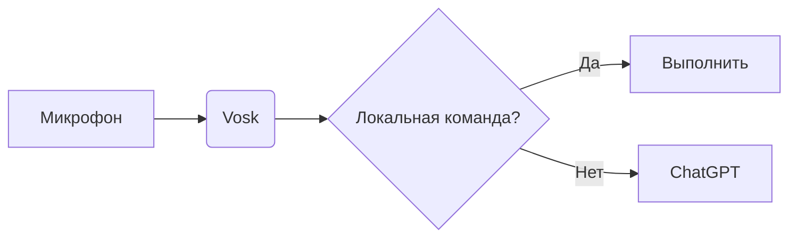

# 🚀 Астра: Оффлайн-голосовой ассистент на Python


**Астра** — это голосовой ассистент с локальным распознаванием речи (Vosk) и синтезом (pyttsx3). Он умеет управлять системой, искать информацию в интернете, играть музыку/фильмы и даже общаться через ChatGPT!  

> 🔥 **Фишка проекта**: Работает полностью оффлайн (кроме ChatGPT и погоды), не требует API-ключей (кроме OpenWeather).  

## 🌟 Возможности
- **Голосовое управление**: Просто скажите "Астра" и команду.  
- **Системные команды**:  
  - 🖥️ Выключение/перезагрузка ПК
  - ⏰ Узнать время и дату  
  - 🗑️ Очистка корзины  
  - ⌨️ Горячие клавиши
  - 📋 Ввод текста голосом 
- **Мультимедиа**:  
  - 🎵 Воспроизведение музыки (через Hitmotop)  
  - 🎥 Просмотр фильмов (через Kinopoisk + sspoisk)  
- **Интернет**:  
  - 🌤️ Погода (OpenWeather)  
  - 🔍 Поиск в Google  
  - 💬 Общение через ChatGPT (g4f)
## 🏗️ Архитектура системы

## 🚧 Дорожная карта
### 🖱️ Управление мышью
- [ ] Скроллинг страниц вверх/вниз

### 💻 Управление Windows
- [x] Выключение ПК
- [x] Перезагрузка ПК
- [x] Спящий режим
- [x] Очистка корзины
- [ ] Создание папок/документов
- [ ] Управление громкостью (повышение/уменьшение/выключение)
- [ ] Создание скриншотов

### 📝 Работа с текстом
- [x] Печать текста голосом
- [ ] Копирование/вставка текста
- [ ] Эмуляция нажатия пробела
- [ ] Смена языка ввода
- [ ] Отправка сообщений
- [ ] Удаление выделенного текста

### 🌐 Открытие сайтов
- [ ] Вконтакте
- [x] Музыка hitmotop.com
- [ ] Mail.ru
- [x] Фильмы Кинопоиск

### ▶️ Управление YouTube
- [ ] Поиск и воспроизведение видео
- [ ] Управление воспроизведением (пауза, следующее/предыдущее видео)
- [ ] Перемотка (вперёд/назад/к определённой части)
- [ ] Управление субтитрами
- [ ] Полноэкранный режим
- [ ] Управление громкостью

### 🕸️ Управление браузером
- [x] Голосовой поиск в Google
- [ ] Управление масштабом страницы
- [ ] Работа с вкладками (новые, переключение, восстановление)
- [ ] Режим инкогнито
- [ ] Домашняя страница

### 🖥️ Управление окнами
- [x] Закрытие программ
- [ ] Сворачивание/разворачивание окон
- [ ] Полноэкранный режим

### ⚙️ Системные утилиты
- [ ] Калькулятор
- [ ] Настройки Windows
- [ ] Проводник
- [ ] Диспетчер задач
- [ ] Меню Пуск
- [ ] Центр действий

### 🎛️ Управление ассистентом
- [ ] Проверка слышимости
- [ ] Закрытие программы
- [ ] Сворачивание/разворачивание интерфейса
- [ ] Список доступных команд

*Дорожная карта будет обновляться по мере разработки новых функций*
## 🛠️ Технологии
| Модуль          | Описание                          |
|-----------------|-----------------------------------|
| `vosk`          | Оффлайн распознавание речи        |
| `sounddevice`   |Запись аудио с микрофона           |
| `pyttsx3`       | Синтез речи                       |
| `numpy`         | Работа с аудиоданными             |
| `RapidFuzz`     | Нечеткий поиск команд             |
| `g4f`           | Бесплатный ChatGPT API            |
| `selenium`      | Автоматизация браузера для медиа  |
| `webdriver-manager`| Управление драйверами для Selenium|
| `pygame`        | Воспроизведение аудио             |
| `python-dotenv` | Работа с переменными окружения    |
| `pywin32`       | Интеграция с Windows API          |
| `keyboard`      | Эмуляция нажатия клавиш           |
| `pyperclip`     | Работа с буфером обмена           |
| `customtkinter` | Современный GUI интерфейс         |

## 🎯 Примеры команд
```bash
"Астра, открой браузер"  
"Астра, какая погода в Москве?"  
"Астра, выключи компьютер через час"  
```
## 📦 Установка
1. Клонировать репозиторий:
```bash
git clone https://github.com/fetgrigory/Voice_Assistant.git
cd voice-assistant
```
