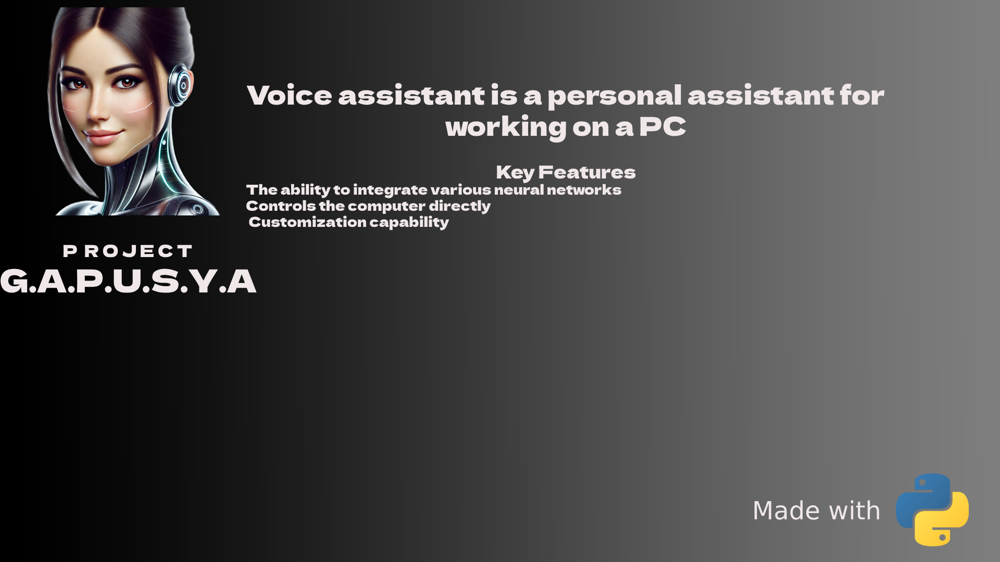
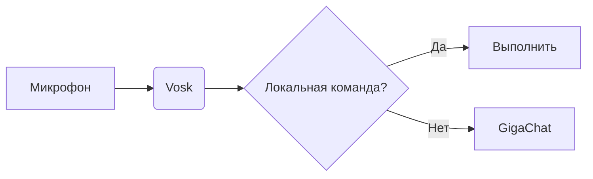

# 🚀 Астра: Оффлайн-голосовой ассистент на Python



**Астра** — голосовой ассистент с локальным распознаванием речи (Vosk) и синтезом (pyttsx3). Он умеет управлять системой, искать информацию в интернете, воспроизводить музыку и фильмы, а также общаться с пользователем, обеспечивая конфиденциальность данных.
  

> 🔥 **Ключевые преимущества**:    
> - Использует локальную LLM-модель GigaChat (Сбер) через LLM Studio. Это обеспечивает полную конфиденциальность (данные не уходят в облако), а также дружелюбные и информативные ответы на русском языке с глубоким пониманием культуры и истории России  
> - Гибкая система команд
## Сравнение голосового ассистента Астра с Алисой и Siri

| Функция / Ассистент          | **Астра** | **Алиса (Яндекс)** | **Siri (Apple)** |
|-------------------------------|------------------------|-------------------|----------------|
| **Работа оффлайн**            |✅ доступно оффлайн почти полностью| ❌ требует интернет | ❌ требует интернет |
| **Конфиденциальность данных** |✅ локальная обработка | ⚠️ данные отправляются на сервер | ⚠️ данные отправляются на сервер |
| **Голосовое управление ПК/системой** |✅ выключение, горячие клавиши, текст голосом | ❌ ограничено | ❌ ограничено |
| **Мультимедиа (музыка/фильмы)** |✅ Hitmotop / Кинопоиск | ⚠️ Яндекс.Музыка (только по подписке, с авторизацией), кино не воспроизводит | ✅ Apple Music / Видео |
| **Интернет-поиск**             |✅ DuckDuckGo (не собирает данные пользователя)| ✅ Яндекс | ✅ Safari, веб-поиск |
| **Интеграция с локальными LLM** |✅ дружелюбные ответы без облака | ❌ только облачные ответы | ❌ только облачные ответы |
| **Расширяемость / модульность** |✅ Легко добавлять команды и сервисы для разработчиков (через модульную архитектуру и `commands.json`) | ❌ ограничено | ❌ ограничено |
| **Системные команды (Windows)** |✅ да, через pywin32/keyboard | ❌ нет | ❌ нет |
| **Управление браузером**       |✅ открытие, поиск, команды | ⚠️ ограничено | ⚠️ ограничено |
| **Стиль общения**           |✅ дружелюбные и структурированные ответы | ✅ стандартный | ✅ стандартный |

## 📌 Оглавление  
- [Возможности](#возможности)
- [Требования](#требования)
- [Структура проекта](#структура-проекта) 
- [Архитектура системы](#архитектура-системы)  
- [Технологии](#технологии)
- [Настройка ИИ-ответов](#настройка-ии-ответов)  
- [Дорожная карта](#дорожная-карта)  
- [Установка](#установка)      


##  Возможности
- **Голосовое управление**: Просто скажите "Астра" и команду.  
- **Системные команды**:  
  - 🖥️ Выключение/перезагрузка ПК
  - ⏰ Узнать время и дату  
  - 🗑️ Очистка корзины  
  - ⌨️ Горячие клавиши
  - 📋 Ввод текста голосом 
- **Мультимедиа**:  
  - 🎵 Музыка и фильмы (Hitmotop и Кинопоиск, воспроизведение реализовано через Selenium)
- **Интернет**:  
  - 🌤️ Погода через wttr.in 
  - 🔍 Поиск в DuckDuckGo

## Требования    
- Windows 10/11
- Python 3.8+  
- Микрофон  
- Интернет *(только для некоторых функций: погода, новости, поиск и онлайн-медиа)*
- Google Chrome

## Структура проекта
```text
Voice_Assistant/
│
├── assistant_core.py             # Основной модуль ассистента
├── main.py                       # Точка входа программы
├── commands.json                 # Конфигурация команд ассистента
├── settings.json                 # Настройки устройства
├── speech_module.py              # Распознавание речи
├── tts_module.py                 # Синтез речи
├── sound_module.py               # Воспроизведение звуков
├── system_control.py             # Управление системой (выключение, горячие клавиши)
├── interface.py                  # GUI ассистента
├── chat_gpt.py                   # Локальная интеграция ChatGPT
│
├── network/                      # Сетевая логика
│   ├── __init__.py               # Инициализация пакета
│   ├── network.py                # Основные сетевые операции
│   ├── music_service.py          # Воспроизведение музыки
│   └── film_service.py           # Воспроизведение фильмов
│
├── sounds/                       # Аудиофайлы для ассистента
│   ├── start.mp3
│   └── shutdown.mp3
├── main_applications/            # Ярлыки программ
│   ├── Google Chrome.lnk
│   ├── Telegram.lnk
│   └── WhatsApp.lnk
│
└── img/                          # Изображения проекта (баннер, иконки разных размеров и др.)
│
├── logs/                         # Логи работы ассистента
│   └── assistant.log
├── requirements.txt              # Зависимости проекта
```
## Архитектура системы

```mermaid
graph LR  
  A[Микрофон] --> B(Vosk)  
  B --> C{Локальная команда?}  
  C -->|Да| D[Выполнить]  
  C -->|Нет| E[ GigaChat]
```  
## Дорожная карта
### 🖱️ Управление мышью
- [ ] Скроллинг страниц вверх/вниз

### 💻 Управление Windows
- [x] Выключение ПК
- [x] Перезагрузка ПК
- [x] Спящий режим
- [x] Очистка корзины
- [ ] Создание папок/документов
- [ ] Управление громкостью (повышение/уменьшение/выключение)
- [ ] Создание скриншотов

### 📝 Работа с текстом
- [x] Печать текста голосом
- [ ] Копирование/вставка текста
- [ ] Эмуляция нажатия пробела
- [ ] Смена языка ввода
- [ ] Отправка сообщений
- [ ] Удаление выделенного текста

### 🌐 Интернет-функции
- [x] Чтение новостей
- [x] Ozon
- [x] Wildberries

### ▶️ Онлайн-медиа
- [ ] Поиск и воспроизведение видео
- [ ] Управление воспроизведением (пауза, следующее/предыдущее видео)
- [ ] Перемотка (вперёд/назад/к определённой части)
- [ ] Управление субтитрами
- [ ] Полноэкранный режим
- [ ] Управление громкостью
- [x] Фильмы Кинопоиск
- [x] Музыка hitmotop.com
### 🕸️ Управление браузером
- [x] Голосовой поиск в DuckDuckGo
- [ ] Управление масштабом страницы
- [ ] Работа с вкладками (новые, переключение, восстановление)
- [ ] Режим инкогнито
- [ ] Домашняя страница

### 🖥️ Управление окнами
- [x] Закрытие программ
- [ ] Сворачивание/разворачивание окон
- [ ] Полноэкранный режим

### ⚙️ Системные утилиты
- [ ] Калькулятор
- [ ] Настройки Windows
- [ ] Проводник
- [ ] Диспетчер задач
- [ ] Меню Пуск
- [ ] Центр действий

### 🎛️ Управление ассистентом
- [ ] Проверка слышимости
- [ ] Закрытие программы
- [ ] Сворачивание/разворачивание интерфейса
- [ ] Список доступных команд

*Дорожная карта будет обновляться по мере разработки новых функций*
## Технологии
| Модуль          | Описание                          |
|-----------------|-----------------------------------|
| `vosk`          | Оффлайн распознавание речи        |
| `sounddevice`   |Запись аудио с микрофона           |
| `pyttsx3`       | Синтез речи                       |
| `numpy`         | Работа с аудиоданными             |
| `RapidFuzz`     | Нечеткий поиск команд             |
| `lmstudio`      | Локальные LLM-модели для ответов  |
| `selenium`      | Автоматизация браузера для медиа  |
| `fake-useragent`| Генерация случайных User-Agent для веб-запросов|
| `webdriver-manager`| Управление драйверами для Selenium|
| `feedparser`   | Чтение новостей RSS-лент|
| `BeautifulSoup`| Очистка текста новостей от HTML-тегов|
| `requests`         |HTTP-запросы к API и веб-серверам|
| `pygame`        | Воспроизведение аудио             |
| `pywin32`       | Интеграция с Windows API          |
| `keyboard`      | Эмуляция нажатия клавиш           |
| `pyperclip`     | Работа с буфером обмена           |
| `customtkinter` | Современный GUI интерфейс         |

## Настройка ИИ-ответов

Ассистент использует локальную LLM-модель с кастомизированным system_prompt<br>
**Правила:**
- **Краткие, но информативные** (1-2 предложения)  
- **Дружелюбные и естественные**
- **Предложение поиска в интернете, если нужны точные данные (курс валют и т.д.)**
- **Блокировку вредоносных, опасных или неэтичных запросов**  
- **Без сложных терминов**  
- **Структурированные** для списков/инструкций  
 
  
## Примеры команд
```bash
"Астра, открой браузер"  
"Астра, какая погода?" → ассистент: "Укажите город" → пользователь называет город → ассистент сообщает погоду"  
"Астра, выключи компьютер"  
```
## Установка
1. Клонирование репозитория:
 ```
https://github.com/fetgrigory/Voice_Assistant.git
   ```
2. Создайте виртуальное окружение для изоляции зависимостей проекта. 
   Используйте команду:
   ```bash
   python -m venv venv
   ```

3. Активируйте виртуальное окружение:
   - На Windows:
     ```bash
     venv\Scripts\activate
     ```
   - На macOS и Linux:
     ```bash
     source venv/bin/activate
     ```
4. Изоляция зависимостей:
   ```bash
     pip install -r requirements.txt
     ```
5. Запустите ассистента командой:
   ```bash
   python main.py
   ```
