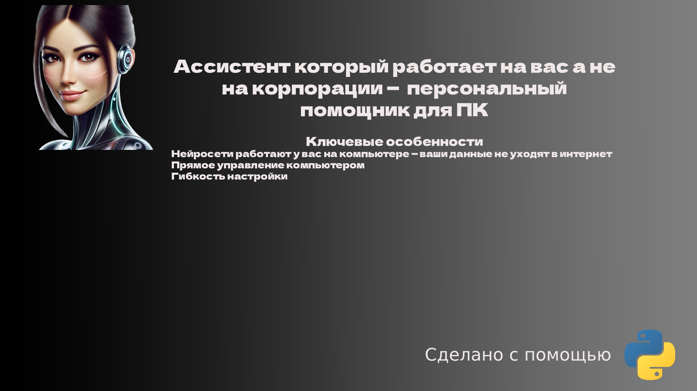

# 🌐 Voice Assistant in Python

Astra is a voice assistant designed to execute various commands using STT (Speech-to-Text) and TTS (Text-to-Speech) technologies. It operates offline and does not require connection to cloud services.<br />
This project implements a voice assistant in Python using object-oriented programming (OOP) and the composition principle. The code adheres to the flake8 style guide, ensuring readability and quality.<br />
The goal of the project is to create a local voice assistant capable of performing various tasks, such as creating notes, playing music, checking the weather, and much more, relying solely on local resources.<br />
# Technology Stack
**Speech Recognition:**  Vosk (a local speech recognition engine)<br />
**Speech Synthesis (TTS):** pyttsx3 (a local speech synthesizer)<br />
**Command Processing**: A command dictionary based on keywords using Python. <br />
**Weather Retrieval via OpenWeather API**: for obtaining weather information.<br /> 

# Architecture and Code Description
**main.py** — the main program module. Here, an instance of the assistant is created, and the main loop for processing commands is launched.<br />
**commands.json** — a module with command settings, where keywords for various commands are defined.<br />
**network.py** — a module for interacting with external services, such, weather retrieval, and web search.<br />
**system_control.py** —  a module responsible for executing system-level commands, such as shutting down, restarting, or putting the PC to sleep. It also includes functionality for managing the recycle bin and controlling system volume.<br />
**chat_gpt.py** —   a module designed for working with language models using the  [gpt4free](https://github.com/xtekky/gpt4free) library, allowing the assistant to send requests and receive responses from various neural networks. This enhances functionality and enables more complex dialogues with the user, providing flexibility in using different models such as ChatGPT and Deep Seek. For interacting with language models such as GPT, the `gpt4free` library is used. This project provides the ability to use language models without the need to connect to official APIs, allowing for local operation.
**Code Example:**
```
from g4f.client import Client

client = Client()
response = client.chat.completions.create(
    model="gpt-4o-mini",
    messages=[{"role": "user", "content": "Hello"}],
    web_search=False
)
print(response.choices[0].message.content)
```
# Usage
### Setting up a virtual environment and running the program

1. Create a virtual environment to isolate project dependencies.
   Use the command:
   ```bash
   python -m venv venv
   ```

2. Activate the virtual environment:
   - On Windows:
     ```bash
     venv\Scripts\activate
     ```
   - On macOS and Linux:
     ```bash
     source venv/bin/activate
     ```
3. Set up your OpenWeather API key in a .env file:
  ```bash
   OPENWEATHER_API_KEY=your_api_key_here
```


4. Run the program with the command:
   ```bash
   python main.py
   ```

## Libraries Used and Language Version
Sounddevice 0.5.1<br />
numpy 2.2.1  <br />
pygame 2.6.1 <br />
python-dotenv 1.0.1 <br />
pyttsx3 2.98  <br />
vosk 0.3.45  <br />
RapidFuzz 3.11.0 <br />
pywin32 <br />
selenium 4.28.1 <br />
webdriver-manager 4.0.2 <br />
python 3.11.9  <br />

# New features that will be added in the future (Information may be updated as needed):
1. Integrate the fuzzy recognition system using the "RapidFuzz" library.  ✅
2. Shut down PC  ✅
3. Restart PC ✅ 
4. Sleep mode  ✅
5. Empty recycle bin ✅
6. ChatGPT ✅
7. Create folder/document
8. Check microphone responsiveness  
9. Increase/decrease/mute volume  
10. Take a screenshot
11. Copy text
12. Paste text
13. Delete selected text
14. Switch language
15. Watching movies online ✅
16. Pause
17. Next video
18. Previous video
19. Listening to music online ✅
20. Rewind backward
21. Fast forward
22. Open the beginning/middle/end of the video
23. Enable/disable subtitles
24. Fullscreen mode
25. Turn sound on/off/increase/decrease
26. Zoom in/zoom out/reset page scale
27. Open browser ✅
28. New tab
29. Traffic: Google Maps API
30. Calendar: Google Calendar API (via google-auth and google-api-python-client)
31. Opening programs: subprocess.run(["program_name"])
32. Incognito mode
33. Open next/previous tab
34. Reopen closed tab
35. Integration with the WhatsApp messenger  
36. Support for multiple languages
37. Calculator
38. Windows Settings
39. List of commands
40. File Explorer
41. Task Manager
42. Start menu
43. Run center/menu
44. Close a program
45. Minimize/maximize a program (fully)
46. Partial minimize

# Athor
Fetkulin Grigory <br />
This project code is provided for informational purposes only. Any use, copying, modification, or distribution without my permission is prohibited. <br />
